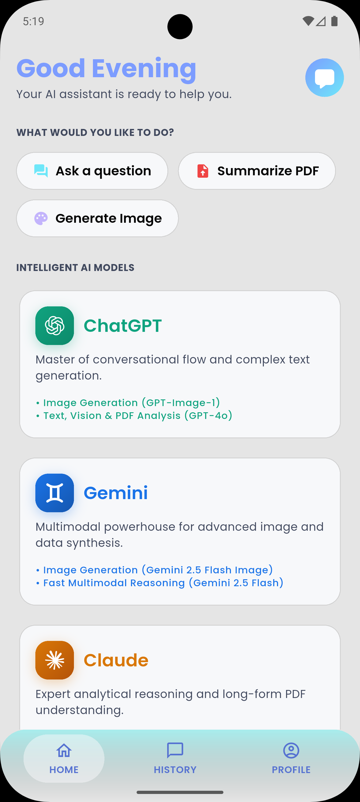
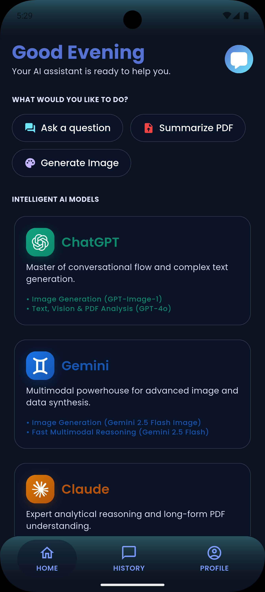
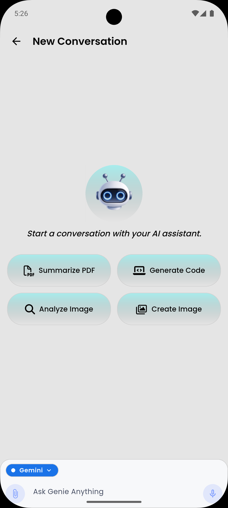
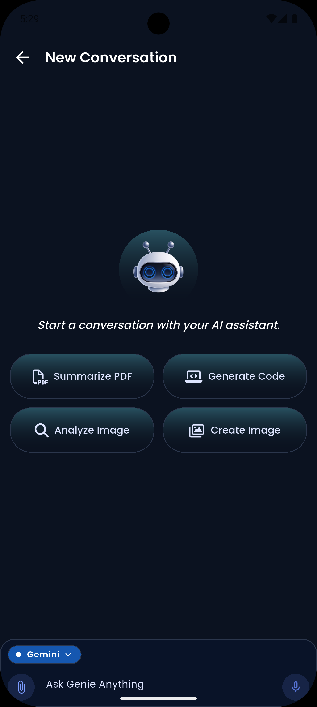
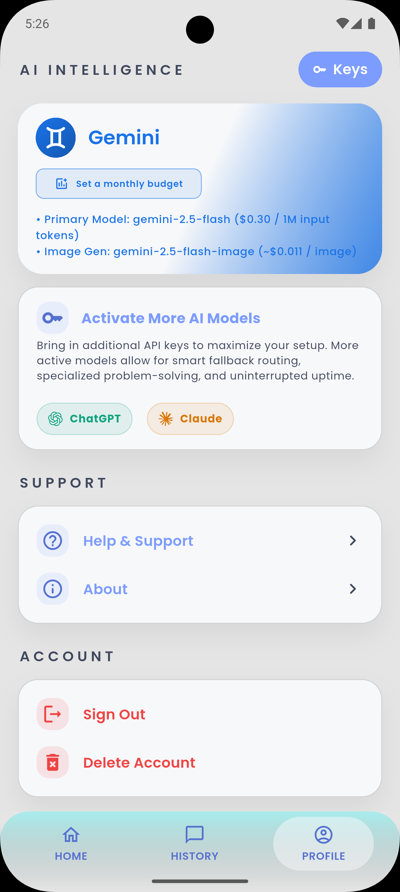
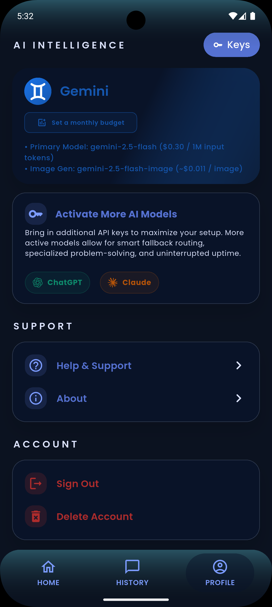
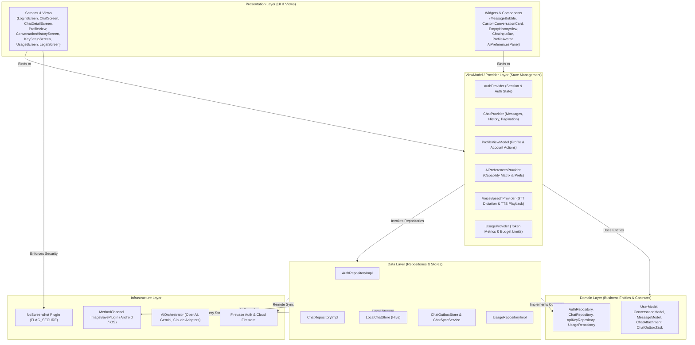

> *Note: Click on the logo to download the latest version of the app apk file.*

<p align="left">
  <!-- The <a> tag makes the image clickable. The align="left" inside the  keeps the float intact. -->
  <a href="https://github.com/ArpitAswal/AI-Voice-Genie/releases/download/v1.0.0/app-release.apk">
    
  </a>
</p>
<!-- Pushes the text block down slightly to vertically center it with the logo -->
<br>

<!-- The main title -->
<h3>&nbsp;&nbsp;AI Voice Genie</h3>

<!-- The tagline (Normal size, bolded) -->
<p>&nbsp;&nbsp;&nbsp;<b>Enterprise-Grade, Unified Multi-Model AI Assistant Engine for Mobile</b></p>

<!-- Clears the float so subsequent README content goes below this header block -->
<br clear="left"/>

<p align="center">
  
  
  
  
  
  
    
  
  
  
</p>

---

## 📝 About the Project

> [!IMPORTANT]
> **Device & Platform Compatibility**
> - **Platform Tested**: Currently, this application has only been rigorously tested on **Android physical devices**. While the codebase is cross-platform (iOS compatible), iOS-specific testing and native channel verification are pending.
> - **UI Optimization**: The user interface is strictly optimized for **mobile phone form factors**. Tablets, iPads, and desktop window sizes are not currently supported and may exhibit layout overflow or improper scaling.


**AI Voice Genie** is a high-performance, production-grade Flutter mobile application engineered as a unified hub for leading artificial intelligence providers. Rather than forcing users to manage fragmented subscriptions across separate apps, AI Voice Genie consolidates **OpenAI**, **Google Gemini**, and **Anthropic Claude** into a single, cohesive, local-first mobile interface.

Designed around a **Bring Your Own Key (BYOK)** paradigm, the application grants users complete ownership over their AI provider accounts and model preferences. Users can seamlessly switch between **OpenAI GPT-4o & GPT-Image-1**, **Google Gemini-2.5-Flash && Gemini-2.5-Flash-Image**, and **Anthropic Claude 3.5 Sonnet** for text generation, AI image generation, multimodal vision analysis, and PDF document parsing.

Built upon a **Local-First Architecture** powered by zero-latency **Hive** local databases, chat history is read and rendered instantaneously without network delays. A durable background outbox (`ChatOutboxTask`) automatically queues mutations offline and reconciles them with **Cloud Firestore** when connectivity returns. The application also integrates real-time continuous **Speech-to-Text (STT)** dictation with custom grammar formatting, offline **Text-to-Speech (TTS)** response playback, detailed **model token cost tracking**, custom **monthly budget limits**, **anti-screenshot API key screen protection**, and **native scoped media downloading** (`Pictures/AI Voice Genie` on Android, `Photos` on iOS).

---

## 📱 App Preview
Experience a meticulously crafted UI supporting fully responsive Light and Dark themes.

| Light Theme | Dark Theme |
|:---:|:---:|
| **Home Screen**<br> | **Home Screen**<br> |
| **Chat & Prompt**<br> | **Chat & Prompt**<br> |
| **Profile & Settings**<br> | **Profile & Settings**<br> |
| **AI Provider Keys Management**<br> | **AI Provider Keys Management**<br> |
| **History Conversation Screen**<br> | **History Conversation Screen**<br> |

| **Voice Assistant Functionality** |

https://github.com/user-attachments/assets/7a4f6b07-e389-4baf-9940-1a2515f3ae66

---

## 🤖 AI Models & Capability Matrix

AI Voice Genie normalizes communications with multiple AI vendor APIs into a single request/response engine (`AiOrchestrator`). Below is the exact breakdown of supported models and their capabilities:

| Provider | Model Identifier         | Primary Usage & Capabilities | Pricing / Cost Metrics |
|---|--------------------------|---|---|
| **OpenAI** | `gpt-4o`                 | Text Generation, Vision Analysis, PDF Context Parsing (128k context window). | $2.50 / 1M prompt tokens, $10.00 / 1M completion tokens. |
| **OpenAI** | `gpt-image-1`            | AI Image Generation with quality tiers (Standard, HD) and aspect ratio bounds. | $0.011 – $0.167 per generated image based on resolution. |
| **Google** | `gemini-2.5-flash`       | Text Generation, Multimodal Vision, PDF Parsing. High-speed low-latency engine. | $0.075 / 1M prompt tokens, $0.30 / 1M completion tokens. |
| **Google** | `gemini-2.5-flash-image` | Native Image Generation with aspect ratios (`1:1`, `16:9`, `4:3`, `3:4`). | $0.020 per generated image. |
| **Anthropic** | `claude-3-5-sonnet`      | Advanced Text Reasoning, Vision Analysis, Complex PDF Document Analysis. | $3.00 / 1M prompt tokens, $15.00 / 1M completion tokens. |

---

## ⚙️ AI Preferences & Dynamic Adaptation

AI Voice Genie implements a smart, adaptive preferences architecture managed by `AiPreferencesProvider` and backed by `ProviderRegistry`:

- **Capability Matrix Filtering**: When a user selects a model, the UI dynamically adapts. For instance, selecting **Claude 3.5 Sonnet** automatically hides image generation controls (preventing invalid API calls), while selecting **Gemini** exposes aspect ratio selectors (`1:1`, `16:9`, `4:3`, `3:4`) and resolution quality tiers.
- **Custom System Instructions**: Users can configure global system persona prompts, max response tokens (up to 4,096 tokens), and vision detail quality (Low, High, Auto).
- **Sanitized Request Building**: Before any API call is initiated, `ProviderRegistry.sanitizePreferences()` strips unsupported parameters from the request payload, ensuring zero HTTP 400 bad request errors due to model capability mismatch.

---

## 📊 Usage Telemetry & Spending Limits

For complete transparency and financial control, AI Voice Genie features a dedicated **Usage Tracking System** (`UsageProvider` & `UsageRepositoryImpl`):

- **Token Metric Breakdown**: Real-time tracking of **Prompt Tokens**, **Completion Tokens**, and **Total Tokens** consumed across every AI model call.
- **Estimated Cost Calculation**: Automatically computes exact USD spending ($) per interaction based on `UsagePricingTable` rates.
- **Monthly Budget Limits**: Users can define a custom monthly budget (e.g. $10.00/month). The UI displays a visual progress bar and triggers warning banners when consumption approaches 80% or 100% of the allocated budget.
- **Historical Telemetry Sync**: Usage data is stored locally in Hive for instant rendering and synced to `AIVoiceGenie/UsersUsage/{uid}` in Cloud Firestore.

---

## 🔒 Security Measures & Screen Protection

Enterprise-grade security controls protect user data and sensitive credentials at every layer:

- 🛡️ **Anti-Screenshot & Anti-Screen Recording Protection (`no_screenshot`)**: The API Key Setup and Management screens (`KeySetupScreen`) invoke native OS security policies (`FLAG_SECURE` on Android and secure window buffering on iOS) in `initState()`. This completely blocks screenshots, screen recordings, and background task switcher previews from capturing sensitive API keys.
- 🔑 **Encrypted On-Device Storage (`flutter_secure_storage` & `encrypt`)**: API keys are encrypted at rest using AES-256 (`encrypt: ^5.0.3`) and stored inside OS-level secure storage (Android Keystore / iOS Keychain).
- 🎭 **Masked Key Display**: Keys are truncated and masked on screen (`sk-a...789`) via `StringExtension.maskedApiKey` to prevent visual shoulder surfing.
- ☁️ **Restricted Firestore Rules**: Remote backup of API keys is stored in `AIVoiceGenie/UsersAPIKeys/{uid}` protected by granular Firestore Security Rules that enforce strict user-only read/write access.
- 🔐 **OAuth2 Security & Nonce Verification**: Google and Apple OAuth sign-in flows generate cryptographic SHA-256 nonces (`crypto: ^3.0.7`) to protect against replay attacks.
- 🗑️ **Hard Account Destruction**: Account deletion executes a total wipe: hard-deletes remote Firestore profile documents and API key records, wipes all local Hive database boxes, resets OAuth tokens, and deletes the Firebase Auth user account.
- 🙈 **Zero-Trust Git Secrets Policy**: Environment files (`.env`), Firebase config files (`google-services.json`, `GoogleService-Info.plist`), key properties, and keystores are strictly excluded from version control via `.gitignore`.

---

## ✨ Key Features

- 🤖 **Multi-Model BYOK Engine**: Native integrations with OpenAI (`gpt-4o`, `gpt-image-1`), Gemini (`gemini-2.5-flash`), and Claude (`claude-3-5-sonnet`).
- ⚡ **Local-First Instant UI**: Hive key-value storage engine ensures instantaneous screen rendering with zero network delay.
- 🔄 **Durable Offline Outbox Sync**: Actions performed offline are stored as `ChatOutboxTask` items and processed asynchronously by `ChatSyncService` when online.
- 📜 **Cursor-Based Pagination**: Memory-efficient infinite scrolling loads 15 conversations per page in history and 30 initial / 20 scroll-up messages in chat detail.
- 🎙️ **Speech-to-Text (STT) Dictation**: Continuous microphone dictation with automatic grammar formatting (capitalization, vocative commas, question clauses).
- 🔊 **Offline Text-to-Speech (TTS)**: Response playback using device-native speech synthesis engines.
- 📄 **Multimodal Vision & PDF Analysis**: Client-side PDF text extraction (`syncfusion_flutter_pdf`) and vision analysis for multi-image prompts.
- 💾 **Native Scoped Gallery Saving**: Scoped MethodChannel (`ImageSavePlugin.kt` for Android MediaStore API 29+ & `ImageSavePlugin.swift` for iOS PhotoKit) saves AI generated images directly to `Pictures/AI Voice Genie` or `Photos` without intrusive permissions.
- 📊 **Usage Telemetry & Spending Limits**: Real-time token consumption metrics, estimated USD cost calculations, and monthly budget alert limits.
- 🌐 **Multilingual & Adaptive Themes**: Light/Dark/System theme toggle and real-time English/Hindi localization.

---

## ⚙️ Functionality & Architecture

AI Voice Genie is built using **Feature-First MVVM (Model-View-ViewModel)** with **Provider** for reactive state management.



---

## 🧠 Engineering & Advanced Algorithms

For technical leads and engineering reviewers, AI Voice Genie implements several advanced patterns to guarantee high performance, resilience, and security on mobile devices:

### 1. Cursor-Based Pagination Algorithm (O(1) Memory Overhead)
Traditional local apps often load entire database tables into memory, causing UI jank as data grows. AI Voice Genie utilizes a **cursor-based pagination algorithm** against the local Hive database. By sorting keys lexicographically (e.g., `timestamp_conversationId`), the app skips directly to the last rendered node and fetches only a discrete chunk (15 conversations or 20 messages). This ensures the app's RAM footprint remains strictly $O(1)$ and the UI maintains a perfect 60-120fps, even if the user has 10,000+ saved messages.

### 2. Eventual Consistency via Durable Outbox Sync
To handle the chaotic nature of mobile networks, the app relies on the **Outbox Pattern**. When a user sends a message offline:
1. The UI optimistically updates instantly from the local Hive store.
2. A `ChatOutboxTask` (containing the mutation payload) is durably serialized to a dedicated Hive outbox.
3. A background `ChatSyncService`, listening to `connectivity_plus`, observes network restoration.
4. The service drains the outbox queue, executing Firestore writes with **Exponential Backoff** to handle transient cloud rate limits, ensuring zero data loss during tunnel/subway network drops.

### 3. Real-Time STT Grammar Enhancement Heuristics
Raw Speech-to-Text (STT) streams are often unformatted and difficult to read. As the native `speech_to_text` engine streams raw words, AI Voice Genie applies a real-time regex-based **Grammar Enhancement Pipeline**. It automatically capitalizes proper nouns (e.g., "openai" → "OpenAI"), detects interrogative clauses to append question marks, and filters out introductory fluff (e.g., "Hey Genie") to ensure AI models receive highly structured, token-efficient prompt strings.

### 4. Zero-Trust Security Architecture
Mobile environments are inherently hostile. AI Voice Genie adopts a zero-trust posture for user API keys:
*   **Hardware-Backed Encryption**: Keys are encrypted via AES-GCM and stored in the Android Keystore / iOS Secure Enclave (`flutter_secure_storage`).
*   **Memory Obfuscation**: Keys are masked (`sk-a...789`) when rendered in memory for the UI.
*   **OS-Level Screen Protection**: The `no_screenshot` plugin dynamically applies Android's `FLAG_SECURE` window layout parameter and iOS secure text buffering upon entering the `KeySetupScreen`. This legally prevents the OS, screen recorders, and malicious background apps from scraping the screen buffer.
*   **Sanitization Pipeline**: Before any HTTP request fires, the `ProviderRegistry` executes a strict capability check, stripping unsupported fields (like image aspect ratios for text-only models) to guarantee zero `400 Bad Request` exceptions.

### 5. Non-Blocking Telemetry & Crash Reporting
To ensure zero impact on UI frame rates, the app implements a "fire-and-forget" telemetry pattern using **Firebase Analytics** and **Firebase Crashlytics**.
*   **Crashlytics**: Automatically intercepts unhandled Dart exceptions, native crashes, and out-of-memory (OOM) errors, pushing stack traces to the cloud without locking the main thread.
*   **Analytics**: Tracks critical user journeys (e.g., `ai_request_success`, `image_downloaded`, `subscription_limit_reached`) asynchronously, allowing engineering teams to monitor model usage and feature adoption in real-time.

---

## 🛠 Tech Stack & Used Packages

Here is the exact list of packages declared in `pubspec.yaml` with their defined versions and operational roles:

| Package | Version | Detailed Purpose & Usage in App |
|---|---|---|
| `flutter` | **3.38.2** | Core cross-platform UI framework SDK. |
| `dart` | **3.10.0** | Underlying null-safe object-oriented language SDK. |
| `provider` | `^6.1.2` | Reactive MVVM state management and ViewModel dependency injection. |
| `firebase_core` | `^3.6.0` | Firebase app initialization and credential binding. |
| `firebase_auth` | `^5.3.1` | Google & Apple OAuth authentication session management. |
| `cloud_firestore` | `^5.4.4` | Cloud database for user profiles, usage metrics, and outbox sync. |
| `firebase_analytics` | `^11.3.3` | Event logging, user telemetry, and usage analytics. |
| `firebase_crashlytics` | `^4.3.0` | Real-time automated crash reporting and stack trace tracking. |
| `google_sign_in` | `^6.2.1` | Native Google OAuth sign-in flow handler. |
| `sign_in_with_apple` | `^7.0.1` | Native Apple OAuth sign-in flow handler for iOS & macOS. |
| `font_awesome_flutter` | `^11.0.0` | Vector brand icons for AI models (OpenAI, Gemini, Claude) and UI controls. |
| `hive` | `^2.2.3` | Local-first key-value database for conversations, messages, and settings. |
| `hive_flutter` | `^1.1.0` | Hive database initialization engine for Flutter. |
| `flutter_secure_storage` | `^9.2.2` | Encrypted platform storage (Android Keystore / iOS Keychain) for user API keys. |
| `encrypt` | `^5.0.3` | AES-256 encryption and decryption utilities for confidential strings. |
| `crypto` | `^3.0.7` | Cryptographic SHA-256 hashing for OAuth nonces and token integrity. |
| `no_screenshot` | `^1.2.0` | Disables screenshots & screen recordings on API key screens (`FLAG_SECURE`). |
| `http` | `^1.2.2` | HTTP client for REST API calls to OpenAI, Gemini, and Claude endpoints. |
| `speech_to_text` | `^7.0.0` | Device-native speech recognition engine for continuous voice dictation. |
| `flutter_tts` | `^4.2.0` | Device-native text-to-speech voice synthesis engine for response playback. |
| `file_picker` | `^8.1.2` | Document file picker dialog for PDF text extraction. |
| `image_picker` | `^1.1.2` | Camera & gallery image picker for vision analysis and avatar updates. |
| `flutter_image_compress` | `^2.4.0` | Image byte compression for avatar uploads and vision payload optimization. |
| `lottie` | `^3.1.2` | Vector animation renderer for empty states, logo animations, and splash. |
| `cached_network_image` | `^3.4.1` | Network image caching with placeholder and fallback rendering. |
| `shimmer` | `^3.0.0` | Animated shimmer skeleton loaders for history and chat lists. |
| `animations` | `^2.0.11` | Material 3 page route transitions and animated switchers. |
| `flutter_markdown` | `^0.7.3` | Markdown renderer for AI assistant responses and syntax code blocks. |
| `flutter_markdown_plus` | `^1.0.12` | Extended markdown styling and table rendering engine. |
| `uuid` | `^4.5.1` | Unique v4 UUID generator for local conversation and message IDs. |
| `intl` | `^0.20.2` | Date/time formatting, number formatting, and localization tools. |
| `connectivity_plus` | `^6.1.0` | Network connectivity monitoring for background outbox sync. |
| `package_info_plus` | `^8.1.1` | Metadata retriever for app version, build number, and package info. |
| `url_launcher` | `^6.3.1` | External launcher specifically for initiating `mailto:` support email links to the developer. |
| `path_provider` | `^2.1.5` | Device file system directory path resolver for Hive and cache storage. |
| `share_plus` | `^10.1.2` | Native OS share sheet integration for exporting AI responses and images. |
| `permission_handler` | `^12.0.1` | Runtime permission request handler for camera and microphone access. |

---

## 📄 Support, Legal & Policies

AI Voice Genie provides complete transparency and user support through dedicated legal and assistance interfaces:

- **Legal Section (`LegalScreen`)**: Features a segmented tab bar toggling between the **Privacy Policy** (`assets/legal/privacy_policy.md`) and **Terms of Service** (`assets/legal/terms_of_service.md`). It details data handling practices, zero data sale commitments, and AI model usage policies.
- **About App (`AboutScreen`)**: Displays app metadata, current version (`package_info_plus`), copyright information, and developer credits.
- **Support Panel (`SupportPanel`)**: Embedded in the Profile screen, providing direct access to a `mailto:` customer support email link via `url_launcher` allowing users to contact the app developer directly.

---

## 🚀 Getting Started

### Prerequisites

- **Flutter SDK**: `3.38.2`
- **Dart SDK**: `3.10.0`
- Xcode 15+ (for iOS builds) or Android Studio Jellyfish+ (for Android builds)
- A Firebase project with Auth (Google & Apple) and Cloud Firestore enabled.

### Installation

1. **Clone the repository**:
   ```bash
   git clone https://github.com/YourUsername/voice_genie.git
   cd voice_genie
   ```

2. **Install exact package dependencies**:
   ```bash
   flutter pub get
   ```

3. **Firebase Setup**:
    - Add `google-services.json` to `android/app/`.
    - Add `GoogleService-Info.plist` to `ios/Runner/`.

4. **Launch the App**:
   ```bash
   flutter run
   ```

---

## 🤝 Contributing & Issue Tracking

We welcome bug reports and feature requests from both end-users and internal team members! Please use our GitHub repository's Issue Tracker to submit your feedback.

### 1. Issue Reporting (Bugs & Features)
- **GitHub Issues:** Please raise all issues directly in the repository's issue tracker.
- **Bug Reports**: Include your device model, OS version, steps to reproduce, and attach any relevant screenshots or screen recordings. Internal team members should also attach Firebase Crashlytics log IDs if applicable.
- **Feature Requests**: Outline the proposed feature, the target AI model (OpenAI, Gemini, Claude), and your use case.

### 2. Branching Strategy
Always branch off the `development` branch using descriptive naming conventions:
- `feature/your-feature-name` (e.g., `feature/claude-vision-support`)
- `fix/issue-description` (e.g., `fix/hive-pagination-crash`)
- `hotfix/critical-bug` (for production emergencies)

### 3. Creating a Pull Request (PR)
1. Ensure your local branch is up to date with `development`.
2. Run code formatting: `dart format lib/`
3. Run static analysis: `flutter analyze` (Must pass with 0 issues).
4. Submit the PR and request review from at least one senior engineer or technical lead.

---

## 📜 License

Copyright © 2026 Arpit Aswal.

This repository is provided for portfolio and evaluation purposes only.

Commercial use, redistribution, modification, or reproduction without written permission is prohibited.