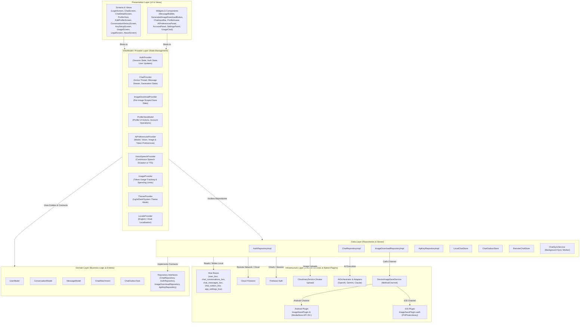

# Architecture

## Overview
- **AI Voice Genie** is a multi-model AI assistant mobile application built with Flutter using Feature-First MVVM architecture with Provider.
- Isolation of concerns: Repositories encapsulate network, database, and platform dependencies away from UI logic.
- AI requests support text generation, image generation, multi-image vision analysis, and multi-PDF document parsing via a centralized `AiOrchestrator` routing to provider adapters (OpenAI, Gemini, Claude).
- Local-First Storage & Offline Sync: Hive handles instant UI reads/writes (`chat_conversations_box`, `chat_messages_box`) with cursor-based pagination, an outbox queue (`chat_outbox_box`) captures pending mutations, and `ChatSyncService` reconciles remote Firestore changes asynchronously.
- Platform Native Channel Integration: Native Kotlin (`ImageSavePlugin.kt`) and Swift (`ImageSavePlugin.swift`) plugins handle scoped media downloads directly to device galleries (`Pictures/AI Voice Genie` on Android, `Photos` on iOS).

---

## MVVM Architecture Tree



---

## Folder Structure
- `lib/core`:
  - `constants/`: `app_constants.dart` (limits, assets), `firebase_collections.dart` (Firestore paths/field keys).
  - `enums/`: `app_enums.dart` (centralized enums for AI models, capabilities, roles, sync states, image download states, device save results).
  - `services/`: `storage_service.dart` (Hive initialization), `device_image_save_service.dart` (MethodChannel), `analytics_service.dart` (Firebase Analytics), `cloudinary_service.dart` (Image upload), `secure_storage_service.dart` (Encrypted keys), `ai_preferences_service.dart` (AI settings persistence).
  - `localization/`: `app_localizations.dart` (EN/HI translations map), `locale_provider.dart` (Locale state).
  - `theme/`: `app_theme.dart`, `app_colors.dart`, `theme_provider.dart`.
  - `routing/`: `app_routes.dart` (Route names and page builders).
  - `error/`: `effect_bus.dart` (Global async error propagation).
- `lib/ai_layer`:
  - `orchestrator/`: `ai_orchestrator.dart` (Central AI entry point).
  - `adapters/`: Provider-specific HTTP adapters (`openai_adapter.dart`, `gemini_adapter.dart`, `claude_adapter.dart`).
  - `models/`: Unified request/response DTOs and capability matrix.
- `lib/features/`:
  - `auth/`: Sign-in UI, `AuthProvider`, `AuthRepositoryImpl`, `UserModel`.
  - `key_setup/`: `KeySetupScreen`, `ApiKeyProvider`, `ApiKeyRepositoryImpl`.
  - `chat/`: `ChatScreen`, `ChatDetailScreen`, `ConversationHistoryScreen`, `ChatProvider`, `ChatRepositoryImpl`, `LocalChatStore`, `ChatOutboxStore`, `RemoteChatStore`, `ChatSyncService`.
  - `image_download/`: `ImageDownloadRepository`, `ImageDownloadRepositoryImpl`, `ImageDownloadProvider`, `GeneratedImageDownloadButton`.
  - `profile/`: `ProfileView`, `EditProfileScreen`, `ProfileViewModel`, `ProfileAvatar`, `AccountPanel`, `AiPreferencesPanel`, `SettingsPanel`, `SupportPanel`.
  - `voice_speech/`: `VoiceSpeechProvider`, continuous dictation widgets, grammar enhancement, TTS playback handler.
  - `usage/`: `UsageProvider`, `UsageRepositoryImpl`, token cost calculation, spending limit controls.
  - `legal_section/`: `LegalScreen` (Privacy Policy / Terms of Service toggle), `AboutScreen`.
  - `onboarding/`: Onboarding carousel slides.
  - `intro/`: `IntroScreen` home landing page.
  - `splash/`: Initial splash route and session router.

---

## Layer Responsibilities

### 1. Presentation Layer
- Contains only UI elements (Widgets, Screens, Dialogs, Snackbars, Sheets).
- Binds to ViewModels via `Provider.of`, `Consumer`, or `context.watch/select`.
- Completely decoupled from direct database or network calls.

### 2. ViewModel / Provider Layer
- Extends `ChangeNotifier` to hold reactive state and business logic.
- Exposes immutable state getters and action methods for the UI.
- Delegates data persistence and network operations to Repositories and Services.

### 3. Domain Layer
- Defines core business entities (`UserModel`, `ConversationModel`, `MessageModel`, `ChatAttachment`, `ChatOutboxTask`).
- Declares repository interfaces (`ChatRepository`, `AuthRepository`, `ImageDownloadRepository`, `ApiKeyRepository`).

### 4. Data Layer
- Implements domain repository interfaces (`ChatRepositoryImpl`, `ImageDownloadRepositoryImpl`, etc.).
- Manages local-first Hive storage (`LocalChatStore`), outbox tasks (`ChatOutboxStore`), remote Firestore sync (`RemoteChatStore`), and background sync workers (`ChatSyncService`).

### 5. Infrastructure Layer
- External APIs (Firebase Auth, Cloud Firestore, Firebase Analytics, Cloudinary).
- Native OS platform bridges (`DeviceImageSaveService` calling `ImageSavePlugin.kt` on Android and `ImageSavePlugin.swift` on iOS).

---

## Dart File Placement Audit

### Core Infrastructure Files

| File | Class / Type | Directory Judgment | Purpose |
|---|---|---|---|
| `lib/core/constants/app_constants.dart` | `AppConstants` | Correct in `core/constants` | App limits, asset paths, timeouts, default prompt templates. |
| `lib/core/constants/firebase_collections.dart` | `FirebaseCollections` | Correct in `core/constants` | Canonical Firestore collection names, document paths, and field keys. |
| `lib/core/enums/app_enums.dart` | `AiProviderId`, `AiCapability`, `MessageRole`, `MessageStatus`, `SyncStatus`, `ImageDownloadState`, `DeviceImageSaveResult` | Correct in `core/enums` | All application-wide enums for data models, UI states, analytics, and platform channels. |
| `lib/core/services/storage_service.dart` | `StorageService` | Correct in `core/services` | Global Hive initialization, box management, and data wipes. |
| `lib/core/services/device_image_save_service.dart` | `DeviceImageSaveService` | Correct in `core/services` | MethodChannel interface for saving images to native device galleries. |
| `lib/core/services/analytics_service.dart` | `AnalyticsService` | Correct in `core/services` | Centralized Firebase Analytics logging service. |
| `lib/core/services/cloudinary_service.dart` | `CloudinaryService` | Correct in `core/services` | Cloudinary API wrapper for uploading user profile pictures. |
| `lib/core/services/ai_preferences_service.dart` | `AiPreferencesService` | Correct in `core/services` | Local Hive persistence for AI preferences (model, token limits, vision quality, image size). |
| `lib/core/localization/app_localizations.dart` | `AppLocalizations` | Correct in `core/localization` | English and Hindi localization lookup table with parameter replacement. |

### Feature Files Overview

| Feature | Primary Screens / Widgets | ViewModels / Providers | Repositories / Data Stores |
|---|---|---|---|
| **Auth** | `LoginScreen` | `AuthProvider` | `AuthRepositoryImpl` |
| **Key Setup** | `KeySetupScreen` | `ApiKeyProvider` | `ApiKeyRepositoryImpl` |
| **Chat** | `ChatScreen`, `ChatDetailScreen`, `ConversationHistoryScreen`, `MessageBubble` | `ChatProvider` | `ChatRepositoryImpl`, `LocalChatStore`, `ChatOutboxStore`, `RemoteChatStore`, `ChatSyncService` |
| **Image Download** | `GeneratedImageDownloadButton` | `ImageDownloadProvider` | `ImageDownloadRepositoryImpl`, `DeviceImageSaveService` |
| **Profile** | `ProfileView`, `EditProfileScreen`, `ProfileAvatar`, `AccountPanel`, `AiPreferencesPanel` | `ProfileViewModel`, `AuthProvider`, `AiPreferencesProvider` | `AuthRepositoryImpl`, `AiPreferencesService` |
| **Voice Speech** | `VoiceSpeechWidget`, `VoiceSettingsDialog` | `VoiceSpeechProvider` | `SpeechToText`, `FlutterTts` |
| **Usage** | `UsageScreen`, `UsageCard` | `UsageProvider` | `UsageRepositoryImpl` |
| **Legal** | `LegalScreen`, `AboutScreen` | N/A | Static localized assets & metadata |


# AI Voice Genie — Flutter MVVM Directory Structure
# Complete Developer Reference for Adding New Files

---

## The Golden Rule Before Adding Any File

Answer these four questions first:

1. Is it a screen the user sees?              → presentation/ (*_screen.dart)
2. Is it state + business logic?              → presentation/ (*_provider.dart)
3. Is it a reusable UI component?             → presentation/widgets/ (*_widget.dart or descriptive name)
4. Is it data access (API, DB, cache)?        → data/ (*_repository_impl.dart)
5. Is it a contract/entity (no Flutter)?      → domain/ (*_repository.dart or *_model.dart)
6. Is it shared across the whole app?         → core/ (appropriate subfolder)
7. Is it AI provider logic?                   → ai/ (appropriate subfolder)

---

## Naming Conventions (Strict)

| File Type               | Suffix                    | Example                          |
|-------------------------|---------------------------|----------------------------------|
| Screen (View)           | `_screen.dart`            | `login_screen.dart`              |
| State Manager (VM)      | `_provider.dart`          | `auth_provider.dart`             |
| Domain Entity (Model)   | `_model.dart`             | `user_model.dart`                |
| Repository Interface    | `_repository.dart`        | `auth_repository.dart`           |
| Repository Impl         | `_repository_impl.dart`   | `auth_repository_impl.dart`      |
| Reusable Widget         | `_widget.dart` or name    | `message_bubble.dart`            |
| Service (singleton)     | `_service.dart`           | `analytics_service.dart`         |
| AI Adapter              | `_adapter.dart`           | `openai_adapter.dart`            |
| Constants class         | `app_*.dart`              | `app_colors.dart`                |
| Enum file               | `app_enums.dart`          | always one file                  |
| Extension file          | `*_extensions.dart`       | `context_extensions.dart`        |

---

## MVVM Layer Responsibilities

```
┌─────────────────────────────────────────────────────────────────┐
│  VIEW  (*_screen.dart, *_widget.dart)                           │
│  • Renders UI only. Zero business logic.                        │
│  • Reads state via context.watch<Provider>() or Consumer        │
│  • Calls ViewModel methods on user interaction                  │
│  • Uses: AppColors, AppTextStyles, AppLocalizations, AppRoutes  │
│  • Never touches: Firebase, HTTP, Hive, AI APIs directly        │
├─────────────────────────────────────────────────────────────────┤
│  VIEWMODEL  (*_provider.dart extends ChangeNotifier)            │
│  • Holds all UI state for one feature                           │
│  • Calls Repository interface methods                           │
│  • Calls AnalyticsService for events                            │
│  • Calls EffectBus.safeEffect for non-blocking side effects     │
│  • Calls notifyListeners() when state changes                   │
│  • Never touches: Firebase, HTTP, Hive, Flutter widgets         │
├─────────────────────────────────────────────────────────────────┤
│  DOMAIN  (*_repository.dart, *_model.dart)                      │
│  • Repository interface: abstract class with method signatures  │
│  • Model entities: immutable classes with fromFirestore/toMap   │
│  • No Flutter imports in models (only dart:core)                │
│  • No Firebase or HTTP in interfaces                            │
├─────────────────────────────────────────────────────────────────┤
│  DATA  (*_repository_impl.dart)                                 │
│  • Implements repository interface                              │
│  • All Firebase, HTTP, Hive calls live here                     │
│  • Maps raw errors to typed exceptions                          │
│  • Returns typed models to the ViewModel                        │
│  • Never imported directly by View or ViewModel (use interface) │
└─────────────────────────────────────────────────────────────────┘
```

---

## Complete Directory Tree

```
lib/
│
├── main.dart
│   PURPOSE  : App entry point. Wires providers, theme, locale, routing.
│   ADD HERE : Nothing. This file only registers root-level providers.
│              When adding a new feature Provider → add ChangeNotifierProvider
│              in the _buildProviders() list only.
│
│
├── core/                          ← SHARED INFRASTRUCTURE (no feature logic)
│   │
│   ├── constants/
│   │   │  PURPOSE  : Pure static values. No logic. No Flutter widgets.
│   │   │  ADD HERE : New constant → find the right file or create new one.
│   │   │             Rule: if it's a color → app_colors.dart
│   │   │                   if it's a string/number constant → app_constants.dart
│   │   │                   if it's a Hive key → storage_keys.dart
│   │   │                   if it's a Firestore path/field/event → firebase_collections.dart
│   │   │
│   │   ├── app_colors.dart
│   │   │     CONTAINS : All Color constants (brand, background, text, status,
│   │   │                AI model brand colors, chat bubble colors, gradients)
│   │   │     ADD HERE : New named Color constant only.
│   │   │     NEVER    : Hardcode a Color in any widget. Always reference AppColors.
│   │   │
│   │   ├── app_text_styles.dart
│   │   │     CONTAINS : lightTextTheme, darkTextTheme (13 text styles each)
│   │   │     ADD HERE : Nothing. Use existing styles. If a new scale is needed,
│   │   │                add it here and add corresponding style to both themes.
│   │   │     NEVER    : Create a TextStyle inline in a widget.
│   │   │
│   │   ├── app_constants.dart
│   │   │     CONTAINS : App info, validation limits, animation durations,
│   │   │                AI model names, base URLs, token limits, asset paths,
│   │   │                box names, retry counts, pagination sizes
│   │   │     ADD HERE : New String/int/Duration/double constant.
│   │   │     NEVER    : Magic numbers or strings inside feature code.
│   │   │
│   │   ├── storage_keys.dart
│   │   │     CONTAINS : All Hive key strings (session, settings, AI prefs, voice)
│   │   │     ADD HERE : New Hive key string when adding a new persisted setting.
│   │   │     RULE     : Every StorageService.setXxx() call must use a key from here.
│   │   │
│   │   └── firebase_collections.dart
│   │         CONTAINS : Root collection name, subcollection names,
│   │                    path builder methods (userDoc, apiKeyDoc, conversationDoc),
│   │                    all Firestore field names, analytics event names,
│   │                    analytics parameter names
│   │         ADD HERE : New Firestore field, new analytics event/param, new path builder.
│   │         RULE     : Every Firestore path must use a builder from here, not a raw string.
│   │
│   ├── enums/
│   │   └── app_enums.dart
│   │         CONTAINS : AiProviderId, AiCapability, AuthState, ApiKeyStatus,
│   │                    MessageRole, MessageContentType, MessageStatus,
│   │                    AiFailureType, SocialAuthProvider, ThemeType,
│   │                    AppFeature, ConversationCapability, VoiceRecordingState
│   │         ADD HERE : New enum when a new typed state needs to exist app-wide.
│   │         RULE     : One file for all enums. No feature-specific enums in feature folders.
│   │                    Exception: AiImageSize lives in ai/models/ai_request.dart
│   │                    because it is request-specific.
│   │
│   ├── extensions/
│   │   │  PURPOSE  : Dart extension methods on existing types (BuildContext, String, DateTime)
│   │   │  ADD HERE : New extension method on an existing type.
│   │   │             Create a new file if extending a type not yet covered.
│   │   │
│   │   ├── context_extensions.dart
│   │   │     CONTAINS : ResponsiveExtension (isTablet, screenWidth, responsive<T>)
│   │   │                ThemeExtension (theme, colorScheme, isDark, primaryColor)
│   │   │                MediaQueryExtension (topPadding, bottomPadding, isKeyboardVisible)
│   │   │     ADD HERE : New BuildContext extension method.
│   │   │     EXAMPLE  : Adding context.hapticFeedback() → add here.
│   │   │
│   │   └── string_extensions.dart
│   │         CONTAINS : StringExtension (capitalize, titleCase, isValidEmail,
│   │                    truncate, maskedApiKey)
│   │                    DateTimeExtension (toTimeString, toDateString,
│   │                    toConversationDate, toMessageTimestamp)
│   │                    NullableStringExtension (isNullOrEmpty, orEmpty)
│   │     ADD HERE : New String or DateTime extension method.
│   │
│   ├── theme/
│   │   ├── app_theme.dart
│   │   │     CONTAINS : getLightTheme(context), getDarkTheme(context)
│   │   │                Full Material 3 config: AppBar, Input, Buttons,
│   │   │                Card, Checkbox, Icon, Divider, BottomNav, Chip,
│   │   │                Dialog, BottomSheet themes
│   │   │     ADD HERE : New component theme block (e.g., TabBarTheme, SnackBarTheme)
│   │   │     NEVER    : Widget-level color or style overrides that should be global.
│   │   │
│   │   └── theme_provider.dart        ← [VIEWMODEL]
│   │         CONTAINS : ThemeMode state, initialize(), setTheme(ThemeType)
│   │         CONSUMED : MaterialApp.themeMode via Consumer2<ThemeProvider, LocaleProvider>
│   │
│   ├── localization/
│   │   ├── app_localizations.dart
│   │   │     CONTAINS : EN + HI string maps (100+ keys), translate(key),
│   │   │                named getters for common strings
│   │   │     ADD HERE : New localization key → add to BOTH 'en' and 'hi' maps.
│   │   │     RULE     : Every user-facing string must have a key here.
│   │   │                Never pass raw English strings to UI widgets.
│   │   │
│   │   └── locale_provider.dart       ← [VIEWMODEL]
│   │         CONTAINS : Locale state, supportedLocales, initialize(), setLocale()
│   │         CONSUMED : MaterialApp.locale via Consumer2
│   │
│   ├── router/
│   │   └── app_routes.dart
│   │         CONTAINS : All route name constants (static const String),
│   │                    generateRoute() switch, navigation helpers
│   │                    (navigateTo, navigateAndReplace, navigateAndRemoveUntil,
│   │                    pop, popToFirst, popUntilRoute),
│   │                    typed argument classes (*Arguments extends RouteArguments),
│   │                    TransitionType enum
│   │         ADD HERE : When adding a new screen:
│   │                    1. Add static const String routeName = '/route-name';
│   │                    2. Add import for the new screen at the top
│   │                    3. Add case routeName: in generateRoute() switch
│   │                    4. Add typed XxxArguments class if the route takes params
│   │         NEVER    : Call Navigator.push() or Navigator.pushNamed() directly in a widget.
│   │                    Always use AppRoutes.navigateTo(context, AppRoutes.routeName)
│   │
│   ├── services/
│   │   │  PURPOSE  : Singleton service classes. Wrap external SDKs.
│   │   │             No Flutter widgets. No business logic.
│   │   │  ADD HERE : New singleton service for a new external dependency.
│   │   │
│   │   ├── storage_service.dart
│   │   │     CONTAINS : Hive singleton. Three boxes: settings, user, conversationCache.
│   │   │                getString/setString, getBool/setBool, getInt/setInt,
│   │   │                getUserData/setUserData, conversationCache ops, clearAll()
│   │   │     CONSUMED : AuthRepositoryImpl, ApiKeyRepositoryImpl,
│   │   │                ChatRepositoryImpl, ThemeProvider, LocaleProvider
│   │   │
│   │   ├── analytics_service.dart
│   │   │     CONTAINS : Firebase Analytics wrapper (singleton).
│   │   │                logSignInButtonTapped, logAiRequestInitiated,
│   │   │                logAiRequestSuccess, logAiRequestFailed,
│   │   │                logAiFallbackTriggered, logAiCapabilityGap,
│   │   │                logFeatureUsed, logModelKeyAdded, logModelKeyRemoved,
│   │   │                logUserSignedIn, logUserRegistered, setUserId, clearUserId
│   │   │     ADD HERE : New analytics event method when tracking a new action.
│   │   │     RULE     : Never call FirebaseAnalytics.instance directly in a feature.
│   │   │
│   │   └── secure_storage_service.dart
│   │         CONTAINS : flutter_secure_storage wrapper.
│   │                    write, read, delete, containsKey, deleteAll
│   │         CONSUMED : (future) token management, sensitive session data
│   │
│   ├── error/
│   │   ├── ai_exception.dart
│   │   │     CONTAINS : sealed AiException, AiTransientException,
│   │   │                AiRateLimitException, AiHardErrorException,
│   │   │                AiCapabilityGapException, AiExhaustedException,
│   │   │                mapHttpErrorToAiException() helper
│   │   │     ADD HERE : Nothing. Extend if a new AI error type is needed (rare).
│   │   │
│   │   ├── effect_bus.dart
│   │   │     CONTAINS : EffectBus singleton. emit(error, stackTrace).
│   │   │                safeEffect(() async { ... }) wrapper.
│   │   │     CONSUMED : All repository impls for non-fatal background errors.
│   │   │                AiOrchestrator for exhaustion errors.
│   │   │     RULE     : Wrap all background Firestore writes in safeEffect().
│   │   │
│   │   └── global_effect_listener.dart  ← [VIEW — wrapper widget]
│   │         CONTAINS : StatefulWidget that wraps the Navigator tree.
│   │                    Listens to EffectBus.stream → shows MessageUtils.showWarning.
│   │         POSITION : Injected at MaterialApp.builder level in main.dart.
│   │         NEVER    : Move this or create a second instance.
│   │
│   ├── utils/
│   │   ├── validators.dart
│   │   │     CONTAINS : validateEmail, validatePassword, validateRequired,
│   │   │                validateName, validatePrompt, validateApiKey,
│   │   │                validateImagePrompt, validateDate
│   │   │     ADD HERE : New static validator method for a new input type.
│   │   │     RULE     : All form validation goes through here.
│   │   │                Never write inline validation logic in a screen.
│   │   │
│   │   ├── message_utils.dart
│   │   │     CONTAINS : MessageUtils (showSuccess, showError, showWarning,
│   │   │                showSuccessToast, showErrorToast, showWarningToast)
│   │   │                MessageExtensions on BuildContext
│   │   │                (context.showSuccess, context.showError, etc.)
│   │   │     RULE     : Never call ScaffoldMessenger directly in any widget.
│   │   │
│   │   └── loading_overlay.dart
│   │         CONTAINS : LoadingOverlay (show, hide, wrap, isShowing)
│   │                    LoadingOverlayExtension on BuildContext
│   │                    (context.showLoading, context.hideLoading, context.withLoading)
│   │         RULE     : Always hide in a finally block. Use wrap() for auto hide.
│   │
│   └── core.dart   ← barrel export. Add new core file exports here.
│
│
├── ai/                            ← AI ORCHESTRATION LAYER (no feature logic)
│   │  PURPOSE  : Sits between feature Providers and AI providers.
│   │             Features never import adapters directly.
│   │             Features only call AiOrchestrator.instance.execute()
│   │
│   ├── models/
│   │   │  PURPOSE  : Shared AI request/response/config data classes.
│   │   │  ADD HERE : New AI-specific data class (not a feature-specific entity).
│   │   │
│   │   ├── ai_request.dart
│   │   │     CONTAINS : AiRequest class (capability, uid, prompt, history,
│   │   │                imageBytes, imageMimeType, imageSize, pdfText, pdfFileName)
│   │   │                AiImageSize enum (square, landscape, portrait)
│   │   │     ADD HERE : New field on AiRequest when a new capability needs new input.
│   │   │
│   │   ├── ai_response.dart
│   │   │     CONTAINS : AiResponse class (modelUsed, capability, contentType,
│   │   │                requestId, responseTimeMs, text, imageUrl, imageBase64)
│   │   │                AiResponseContentType enum (text, imageUrl, imageBase64)
│   │   │     ADD HERE : New field when a provider returns a new response type.
│   │   │
│   │   └── ai_provider_config.dart
│   │         CONTAINS : AiProviderConfig (providerId, supportedCapabilities,
│   │                    priority, contextWindowTokens)
│   │         ADD HERE : Nothing. Config instances live in provider_registry.dart.
│   │
│   ├── registry/
│   │   └── provider_registry.dart
│   │         CONTAINS : ProviderRegistry singleton. The capability matrix.
│   │                    Registers OpenAI (priority 1), Gemini (priority 2),
│   │                    Claude (priority 3, no imageGeneration).
│   │                    providersFor(capability), supports(provider, capability),
│   │                    contextWindowFor(provider)
│   │         ADD HERE : When adding a NEW AI provider — add its AiProviderConfig entry.
│   │         RULE     : Claude's imageGeneration absence is enforced here.
│   │                    Never add imageGeneration to Claude's supportedCapabilities.
│   │
│   ├── orchestrator/
│   │   ├── model_selector.dart
│   │   │     CONTAINS : ModelSelector (static, pure, no state).
│   │   │                select(capability, userKeyedProviders) → List<AiProviderId>
│   │   │                isCapabilityAvailable() → bool
│   │   │                providerNamesFor(capability) → List<String>
│   │   │     ADD HERE : Nothing. This is a pure function — no new state.
│   │   │
│   │   └── ai_orchestrator.dart
│   │         CONTAINS : AiOrchestrator singleton.
│   │                    execute(request, userKeyedProviders) → AiResponse
│   │                    Retry logic (max 2, exponential backoff 500ms/1000ms)
│   │                    Fallback pipeline (transient → retry → next provider)
│   │                    Rate limit handling (skip immediately → next)
│   │                    Hard error handling (throw immediately, no retry)
│   │                    EffectBus.emit on exhaustion
│   │                    injectAdapter() for testing
│   │         ADD HERE : Nothing. Logic is complete.
│   │
│   └── adapters/
│       │  PURPOSE  : One adapter per AI provider. Implements AiProviderAdapter.
│       │             Handles HTTP calls, auth headers, response parsing,
│       │             error mapping to AiException types.
│       │  ADD HERE : When adding a new AI provider → new *_adapter.dart file.
│       │
│       ├── ai_provider_adapter.dart
│       │     CONTAINS : abstract AiProviderAdapter interface.
│       │                generateText, generateImage, analyzeImage, parsePdf, execute()
│       │     ADD HERE : New abstract method when adding a new capability to the system.
│       │
│       ├── openai_adapter.dart
│       │     CONTAINS : OpenAI implementation.
│       │                generateText  → POST /v1/chat/completions (gpt-4o)
│       │                generateImage → POST /v1/images/generations (dall-e-3)
│       │                analyzeImage  → POST /v1/chat/completions (gpt-4o vision)
│       │                parsePdf      → POST /v1/chat/completions (PDF as system prompt)
│       │
│       ├── gemini_adapter.dart
│       │     CONTAINS : Gemini implementation.
│       │                generateText  → POST /v1beta/models/gemini-2.5-flash:generateContent
│       │                generateImage → POST /v1beta/models/gemini-2.5-flash-image
│       │                analyzeImage  → multimodal inlineData content blocks
│       │                parsePdf      → text context in prompt
│       │
│       └── claude_adapter.dart
│             CONTAINS : Claude implementation.
│                        generateText  → POST /v1/messages (claude-sonnet-4-5)
│                        generateImage → UnsupportedError (never called — registry blocks it)
│                        analyzeImage  → /v1/messages with base64 image content block
│                        parsePdf      → /v1/messages with system prompt context
│
│
├── features/                      ← FEATURE MODULES
│   │
│   │  RULE: Each feature is self-contained in its own folder.
│   │        A feature folder MUST have this structure:
│   │
│   │        feature_name/
│   │          domain/     ← interfaces + entities (no Flutter, no Firebase)
│   │          data/       ← implementations (Firebase, HTTP, Hive)
│   │          presentation/
│   │            *_screen.dart    ← View
│   │            *_provider.dart  ← ViewModel
│   │            widgets/
│   │              *.dart         ← Reusable sub-widgets for this feature
│   │
│   │  CROSS-FEATURE RULE: Feature A must never import from Feature B's domain or data.
│   │                       Feature A may use Feature B's Provider via context.read<BProvider>().
│   │                       Example: ChatProvider reads ApiKeyProvider.validProviders
│   │                                but never imports ApiKeyRepositoryImpl.
│   │
│   ├── splash/
│   │   └── presentation/
│   │       └── splash_screen.dart              ← [VIEW]
│   │             PURPOSE  : Auth state observer. The single routing authority.
│   │             OBSERVES : AuthProvider (via Consumer)
│   │             NAVIGATES: Based on AuthState + user.onboardingDone + user.keySetupDone
│   │             RULE     : Never navigate based on a button tap. Only react to state.
│   │
│   ├── auth/
│   │   ├── domain/
│   │   │   ├── user_model.dart                 ← [MODEL]
│   │   │   │     CONTAINS : Immutable UserModel entity.
│   │   │   │                fromFirestore(), toFirestoreNewUser(), copyWith()
│   │   │   │                Fields: uid, email, displayName, photoUrl,
│   │   │   │                        authProvider, isNewUser, onboardingDone, keySetupDone
│   │   │   │
│   │   │   └── auth_repository.dart            ← [REPOSITORY INTERFACE]
│   │   │         CONTAINS : abstract AuthRepository
│   │   │                    signInWithGoogle() → UserModel?
│   │   │                    signInWithApple()  → UserModel?
│   │   │                    getCurrentUser()   → UserModel?
│   │   │                    signOut()          → void
│   │   │                    isAppleSignInAvailable → bool
│   │   │                    AuthException, AuthErrorCodes
│   │   │
│   │   ├── data/
│   │   │   └── auth_repository_impl.dart       ← [REPOSITORY IMPLEMENTATION]
│   │   │         CONTAINS : AuthRepositoryImpl implements AuthRepository
│   │   │                    Google Sign-In flow + Firebase credential
│   │   │                    Apple Sign-In flow + nonce generation
│   │   │                    _createOrUpdateUser() → Firestore new/returning user logic
│   │   │                    Apple missing-field fallback (reads Firestore for stored data)
│   │   │                    _persistSession() → Hive writes
│   │   │                    Firebase error code mapping
│   │   │
│   │   └── presentation/
│   │       ├── auth_provider.dart              ← [VIEWMODEL]
│   │       │     STATE    : authState (AuthState enum), currentUser (UserModel?),
│   │       │                authError (String?), isAppleSignInAvailable (bool)
│   │       │     METHODS  : initialize(), signInWithGoogle(), signInWithApple(),
│   │       │                signOut(), clearAuthError()
│   │       │     CONSUMED : SplashScreen (authState), LoginScreen (signIn methods, authError)
│   │       │     WIRED IN : main.dart (lazy: false — eager initialization)
│   │       │
│   │       └── login_screen.dart               ← [VIEW]
│   │             OBSERVES : AuthProvider (authError for error display)
│   │             RENDERS  : App logo, tagline, Google button, Apple button (iOS only)
│   │             ACTIONS  : _handleGoogleSignIn(), _handleAppleSignIn()
│   │             RULE     : Does NOT navigate. SplashScreen handles navigation.
│   │
│   ├── onboarding/
│   │   └── presentation/
│   │       └── onboarding_screen.dart          ← [VIEW]
│   │             CONTAINS : 3-page PageView intro. Skip button. Next/Get Started button.
│   │             NAVIGATES: AppRoutes.navigateAndReplace → AppRoutes.keySetup on finish.
│   │             NOTE     : No ViewModel needed — purely presentational with local page state.
│   │
│   ├── key_setup/
│   │   ├── domain/
│   │   │   ├── api_key_model.dart              ← [MODEL]
│   │   │   │     CONTAINS : Immutable ApiKeyModel.
│   │   │   │                fromFirestore(), toFirestore(), copyWith()
│   │   │   │                Fields: providerId, apiKey, isValid, keyAddedAt, lastValidated
│   │   │   │
│   │   │   └── api_key_repository.dart         ← [REPOSITORY INTERFACE]
│   │   │         CONTAINS : abstract ApiKeyRepository
│   │   │                    validateKey(providerId, apiKey) → bool
│   │   │                    saveKey(uid, providerId, apiKey) → void
│   │   │                    loadKeys(uid) → Map<AiProviderId, ApiKeyModel>
│   │   │                    loadKey(uid, providerId) → ApiKeyModel?
│   │   │                    deleteKey(uid, providerId) → void
│   │   │                    completeKeySetup(uid, preferredProvider) → void
│   │   │                    ApiKeyException, ApiKeyErrorCodes
│   │   │
│   │   ├── data/
│   │   │   └── api_key_repository_impl.dart    ← [REPOSITORY IMPLEMENTATION]
│   │   │         CONTAINS : ApiKeyRepositoryImpl implements ApiKeyRepository
│   │   │                    HTTP validation per provider:
│   │   │                      OpenAI → GET /v1/models (Bearer token)
│   │   │                      Gemini → GET /v1beta/models?key={key}
│   │   │                      Claude → GET /v1/models (x-api-key header)
│   │   │                    429 → treated as valid (key exists, just rate limited)
│   │   │                    Firestore CRUD for apiKeys subcollection
│   │   │                    Hive writes on completeKeySetup()
│   │   │
│   │   └── presentation/
│   │       ├── api_key_provider.dart           ← [VIEWMODEL]
│   │       │     STATE    : _statuses Map<AiProviderId, ApiKeyStatus>
│   │       │                _storedKeys Map<AiProviderId, ApiKeyModel>
│   │       │                _errors Map<AiProviderId, String?>
│   │       │                _isCompletingSetup bool
│   │       │     METHODS  : loadExistingKeys(uid), validateAndSaveKey(uid, provider, key),
│   │       │                deleteKey(uid, provider), completeSetup(uid)
│   │       │     GETTERS  : statusFor(provider), errorFor(provider), maskedKeyFor(provider)
│   │       │                hasAtLeastOneValidKey, firstValidProvider, validProviders
│   │       │     CONSUMED : KeySetupScreen, HomeScreen (_ModelIndicator)
│   │       │     WIRED IN : main.dart (lazy)
│   │       │
│   │       └── key_setup_screen.dart           ← [VIEW]
│   │             OBSERVES : ApiKeyProvider (via Consumer + Selector per card)
│   │             RENDERS  : Setup header, 3 provider cards, security note, Continue button
│   │             ACTIONS  : _handleContinue()
│   │             PARAM    : isInitialSetup bool — hides AppBar on first-time setup
│   │             REUSE    : Same screen used in Settings for key management (Phase 8)
│   │
│   ├── home/
│   │   └── presentation/
│   │       └── home_screen.dart                ← [VIEW]
│   │             OBSERVES : ApiKeyProvider (model indicator chip)
│   │             RENDERS  : AppBar with model indicator, BottomNavigationBar,
│   │                        tab body switcher, FAB per tab
│   │             NAVIGATES: AppRoutes per tab/FAB tap
│   │             NOTE     : No dedicated ViewModel. Local state (tab index) only.
│   │
│   ├── chat/
│   │   ├── domain/
│   │   │   ├── conversation_model.dart         ← [MODEL]
│   │   │   │     CONTAINS : Immutable ConversationModel.
│   │   │   │                fromFirestore(id, data), toFirestore(), copyWith()
│   │   │   │                Fields: id, title, lastMessage, lastMessageAt, createdAt,
│   │   │   │                        messageCount, capability, lastProvider
│   │   │   │
│   │   │   ├── message_model.dart              ← [MODEL]
│   │   │   │     CONTAINS : Immutable MessageModel.
│   │   │   │                MessageModel.userMessage(content) — factory for optimistic
│   │   │   │                MessageModel.aiResponse(...) — factory for AI responses
│   │   │   │                fromFirestore(id, data), toFirestore(), toHistoryEntry()
│   │   │   │                Fields: id, role, content, contentType, timestamp,
│   │   │   │                        modelUsed, tokenCount, status, imageUrl,
│   │   │   │                        pdfName, isOptimistic
│   │   │   │
│   │   │   └── chat_repository.dart            ← [REPOSITORY INTERFACE]
│   │   │         CONTAINS : abstract ChatRepository
│   │   │                    createConversation(), updateConversationMetadata()
│   │   │                    getConversation(), deleteConversation(), getConversations()
│   │   │                    saveMessages(), getMessages()
│   │   │                    cacheMessages(), getCachedMessages(), clearCache()
│   │   │                    ChatException, ChatErrorCodes
│   │   │
│   │   ├── data/
│   │   │   └── chat_repository_impl.dart       ← [REPOSITORY IMPLEMENTATION]
│   │   │         CONTAINS : ChatRepositoryImpl implements ChatRepository
│   │   │                    Firestore batch writes for message pairs
│   │   │                    Paginated queries with orderBy + limit
│   │   │                    Subcollection deletion in batches (for delete conversation)
│   │   │                    Hive JSON cache for active conversation messages
│   │   │
│   │   └── presentation/
│   │       ├── chat_provider.dart              ← [VIEWMODEL]
│   │       │     STATE    : _activeConversation, _messages List<MessageModel>,
│   │       │                _isGenerating, _isLoadingMessages, _hasMoreMessages,
│   │       │                _errorMessage
│   │       │     METHODS  : loadConversation(uid, id), loadMoreMessages(uid, id),
│   │       │                sendMessage(uid, prompt, providers, capability),
│   │       │                deleteConversation(uid), clearConversation(), clearError()
│   │       │     KEY LOGIC: Optimistic UI (add before API call, rollback on failure)
│   │       │                Context history building with token truncation
│   │       │                Firestore saves wrapped in EffectBus.safeEffect (non-blocking)
│   │       │     WIRED IN : main.dart (lazy)
│   │       │
│   │       ├── chat_screen.dart                ← [VIEW]
│   │       │     PURPOSE  : Entry for NEW conversations only.
│   │       │     OBSERVES : ChatProvider (isGenerating)
│   │       │     ACTIONS  : On send → ChatProvider.sendMessage() → on success →
│   │       │                AppRoutes.navigateAndReplace → chatDetail with new id
│   │       │
│   │       ├── chat_detail_screen.dart         ← [VIEW]
│   │       │     PURPOSE  : Active or resumed conversation.
│   │       │     PARAM    : conversationId (required), initialTitle (optional)
│   │       │     OBSERVES : ChatProvider (messages, isGenerating, isLoadingMessages)
│   │       │     ACTIONS  : Send, Delete, scroll-up pagination
│   │       │     WIDGETS  : MessageBubble, TypingIndicator, ChatInputBar
│   │       │
│   │       └── widgets/
│   │           ├── message_bubble.dart         ← [WIDGET]
│   │           │     PURPOSE  : Renders one message. User (right) or AI (left).
│   │           │                Long-press to copy. StatusIcon for user messages.
│   │           │                ModelIndicatorChip above AI responses.
│   │           │     ALSO    : TypingIndicator (three animated dots — AI thinking)
│   │           │
│   │           ├── chat_input_bar.dart         ← [WIDGET]
│   │           │     PURPOSE  : Text input + send button + attach stub + voice stub.
│   │           │                AnimatedSwitcher: voice button ↔ send button.
│   │           │     STUBS   : onVoiceTap (Phase 7), onAttachTap (Phase 5/6)
│   │           │
│   │           └── model_indicator_chip.dart   ← [WIDGET]
│   │                 PURPOSE  : Small colored chip showing which AI responded.
│   │                            Color-coded: OpenAI green, Gemini blue, Claude amber.
│   │
│   ├── conversation_history/
│   │   └── presentation/
│   │       ├── conversation_history_screen.dart ← [VIEW]
│   │       │     PURPOSE  : Paginated list of all past conversations.
│   │       │                Pull-to-refresh. Infinite scroll. Delete on long-press.
│   │       │     NOTE     : Uses ChatRepositoryImpl directly (no dedicated provider
│   │       │                because this screen's state is purely list + pagination).
│   │       │                When to add a HistoryProvider: if filtering, search, or
│   │       │                complex state is added.
│   │       │
│   │       └── widgets/
│   │           └── conversation_tile.dart      ← [WIDGET]
│   │                 PURPOSE  : One row in the history list.
│   │                            Shows: capability icon, title, last message,
│   │                            relative date, provider color dot.
│   │
│   ├── image_generator/
│   │   ├── domain/
│   │   │   └── image_repository.dart           ← [REPOSITORY INTERFACE + MODELS]
│   │   │         CONTAINS : abstract ImageRepository
│   │   │                    processImageResponse(response) → Uint8List?
│   │   │                    saveImageConversation(...) → String? (conversationId)
│   │   │                    saveToGallery(bytes, fileName) → bool
│   │   │                    GeneratedImageResult entity
│   │   │                    ImageException, ImageErrorCodes
│   │   │
│   │   ├── data/
│   │   │   └── image_repository_impl.dart      ← [REPOSITORY IMPLEMENTATION]
│   │   │         CONTAINS : ImageRepositoryImpl implements ImageRepository
│   │   │                    OpenAI URL → HTTP GET → Uint8List
│   │   │                    Gemini base64 → base64.decode() → Uint8List
│   │   │                    Saves image as conversation via ChatRepositoryImpl
│   │   │                    Gallery save (stubbed — needs image_gallery_saver)
│   │   │
│   │   └── presentation/
│   │       ├── image_generator_provider.dart   ← [VIEWMODEL] ← IN PROGRESS
│   │       │     STATE    : _isGenerating, _errorMessage, _currentImage,
│   │       │                _selectedSize (AiImageSize)
│   │       │     METHODS  : generateImage(uid, prompt, validProviders)
│   │       │                setImageSize(size), saveCurrentImageToGallery()
│   │       │                clearImage(), clearError()
│   │       │     KEY LOGIC: Capability gap check BEFORE AiOrchestrator call
│   │       │                (Claude-only key → immediate gap message, no HTTP call)
│   │       │
│   │       ├── image_generator_screen.dart     ← [VIEW] ← PENDING (Phase 5 completion)
│   │       │
│   │       └── widgets/
│   │           ├── image_size_selector.dart    ← [WIDGET] ← DONE
│   │           │     PURPOSE  : Three-option size toggle (square/landscape/portrait)
│   │           │
│   │           └── generated_image_card.dart   ← [WIDGET] ← PENDING (Phase 5 completion)
│   │
│   │
│   │   ┌─────────────────────────────────────────────────────────────┐
│   │   │  PENDING FEATURES — Directory placeholders to add files into │
│   │   └─────────────────────────────────────────────────────────────┘
│   │
│   ├── pdf_reader/                            ← Phase 6
│   │   ├── domain/
│   │   │   ├── pdf_document_model.dart        ← [MODEL] PDF metadata entity
│   │   │   └── pdf_repository.dart            ← [INTERFACE] extract, save, load
│   │   ├── data/
│   │   │   └── pdf_repository_impl.dart       ← [IMPL] syncfusion text extraction + AI
│   │   └── presentation/
│   │       ├── pdf_provider.dart              ← [VIEWMODEL]
│   │       ├── pdf_reader_screen.dart         ← [VIEW]
│   │       └── widgets/
│   │           └── pdf_upload_card.dart       ← [WIDGET]
│   │
│   ├── voice/                                 ← Phase 7
│   │   ├── domain/
│   │   │   └── voice_repository.dart          ← [INTERFACE] STT + TTS contracts
│   │   ├── data/
│   │   │   └── voice_repository_impl.dart     ← [IMPL] speech_to_text + flutter_tts + Whisper
│   │   └── presentation/
│   │       ├── voice_provider.dart            ← [VIEWMODEL]
│   │       └── widgets/
│   │           ├── voice_input_button.dart    ← [WIDGET] mic + pulse animation
│   │           └── tts_playback_button.dart   ← [WIDGET] speaker on AI bubble
│   │
│   ├── settings/                              ← Phase 8
│   │   ├── domain/
│   │   │   └── settings_repository.dart       ← [INTERFACE]
│   │   ├── data/
│   │   │   └── settings_repository_impl.dart  ← [IMPL] Hive reads/writes
│   │   └── presentation/
│   │       ├── settings_provider.dart         ← [VIEWMODEL]
│   │       └── settings_screen.dart           ← [VIEW]
│   │
│   └── profile/                              ← Phase 8
│       └── presentation/
│           ├── profile_provider.dart          ← [VIEWMODEL]
│           └── profile_screen.dart            ← [VIEW]
│
│
└── shared/                        ← SHARED WIDGETS AND COMPONENTS
    │  PURPOSE  : Reusable widgets that are used by MORE THAN ONE feature.
    │             If a widget is used only inside one feature → put it in
    │             that feature's presentation/widgets/ folder.
    │             If it's used across 2+ features → put it here.
    │
    ├── widgets/
    │   │  ADD HERE : Widget files used by multiple features.
    │   │  EXAMPLES : AppButton.dart (custom ElevatedButton wrapper)
    │   │             AppTextField.dart (custom input with validation display)
    │   │             EmptyStateWidget.dart (empty list placeholder)
    │   │             ErrorStateWidget.dart (error retry placeholder)
    │   │             AvatarWidget.dart (user profile image)
    │   │             CapabilityGapCard.dart (shown when model lacks a feature)
    │   │
    │   └── (empty — add cross-feature widgets here as they are needed)
    │
    └── components/
        │  ADD HERE : More complex composite components that combine
        │             multiple widgets and might have their own local state.
        │  EXAMPLES : ModelSwitcherBottomSheet (used in Home + Chat + Image + PDF)
        │             ConfirmDeleteDialog (used in Chat + History + Settings)
        │             ProviderStatusRow (shows all 3 providers + their key status)
        │
        └── (empty — add as needed)
```

---

## Decision Tree — Where Does My New File Go?

```
START → What are you building?
│
├── A SCREEN (full page the user navigates to)
│     → features/{feature_name}/presentation/{name}_screen.dart
│     → Register its route in core/router/app_routes.dart
│     → Import it in app_routes.dart generateRoute() switch
│
├── STATE MANAGEMENT (holds data, calls API, notifies UI)
│     → features/{feature_name}/presentation/{name}_provider.dart
│     → Register in main.dart _buildProviders() list
│     → Extends ChangeNotifier
│
├── A REUSABLE UI PIECE
│     Used by ONE feature only?
│       → features/{feature_name}/presentation/widgets/{name}.dart
│     Used by TWO OR MORE features?
│       → shared/widgets/{name}.dart
│
├── A DATA CLASS / ENTITY
│     Feature-specific? (e.g. MessageModel, ConversationModel)
│       → features/{feature_name}/domain/{name}_model.dart
│     AI-layer specific? (e.g. AiRequest, AiResponse)
│       → ai/models/{name}.dart
│
├── A REPOSITORY INTERFACE
│     → features/{feature_name}/domain/{name}_repository.dart
│     → Define the abstract class + typed exception class here
│
├── A REPOSITORY IMPLEMENTATION
│     → features/{feature_name}/data/{name}_repository_impl.dart
│     → Implements the interface from domain/
│     → All Firebase/HTTP/Hive code goes here ONLY
│
├── A NEW AI PROVIDER
│     1. Add AiProviderConfig entry in ai/registry/provider_registry.dart
│     2. Create ai/adapters/{provider_name}_adapter.dart
│     3. Register adapter in AiOrchestrator._adapters map
│     4. Add AiProviderId enum value in core/enums/app_enums.dart
│     5. Add display name constant in core/constants/app_constants.dart
│     6. Add brand colors in core/constants/app_colors.dart
│
├── A NEW AI CAPABILITY
│     1. Add AiCapability enum value in core/enums/app_enums.dart
│     2. Add abstract method to ai/adapters/ai_provider_adapter.dart
│     3. Implement in each adapter (or throw UnsupportedError if not supported)
│     4. Update ProviderRegistry capability sets in provider_registry.dart
│     5. Add route to app_routes.dart for the new feature screen
│
├── A COLOR
│     → core/constants/app_colors.dart → new static const Color
│
├── A STRING CONSTANT
│     → core/constants/app_constants.dart → new static const
│
├── A USER-FACING STRING
│     → core/localization/app_localizations.dart
│       → add key to 'en' map AND 'hi' map simultaneously
│
├── A HIVE STORAGE KEY
│     → core/constants/storage_keys.dart → new static const String
│
├── A FIRESTORE PATH, FIELD, OR ANALYTICS EVENT
│     → core/constants/firebase_collections.dart → appropriate section
│
├── A VALIDATOR
│     → core/utils/validators.dart → new static method returning String?
│
├── A CONTEXT EXTENSION
│     → core/extensions/context_extensions.dart → new extension method
│
├── A STRING/DATETIME EXTENSION
│     → core/extensions/string_extensions.dart → new extension method
│
├── AN ANALYTICS EVENT METHOD
│     → core/services/analytics_service.dart → new async method
│     → Use event/param constants from firebase_collections.dart
│
└── A NEW ENUM
      → core/enums/app_enums.dart → add to existing file (one file for all enums)
```

---

## Dependency Rules (What Can Import What)

```
┌─────────────────────────────────────────────────────────────────────┐
│                         IMPORT RULES                                │
├─────────────────────────────────────────────────────────────────────┤
│ core/        → imports nothing from features/ or ai/               │
│ ai/          → imports from core/ only                             │
│ features/X/  → imports from core/ and ai/ only                    │
│ features/X/  → NEVER imports from features/Y/ domain or data       │
│ features/X/  → MAY use features/Y/ Provider via context.read<>()   │
│ shared/      → imports from core/ only                             │
│                                                                     │
│ domain/      → imports core/enums, core/error, dart:core           │
│               NO Firebase, NO HTTP, NO Hive, NO Flutter widgets    │
│ data/        → imports domain/ + core/services + Firebase + HTTP   │
│ presentation/screens  → imports presentation/providers + core      │
│ presentation/providers → imports domain/ interfaces + core/services│
│               NEVER imports data/ (repository impl) directly        │
└─────────────────────────────────────────────────────────────────────┘
```

