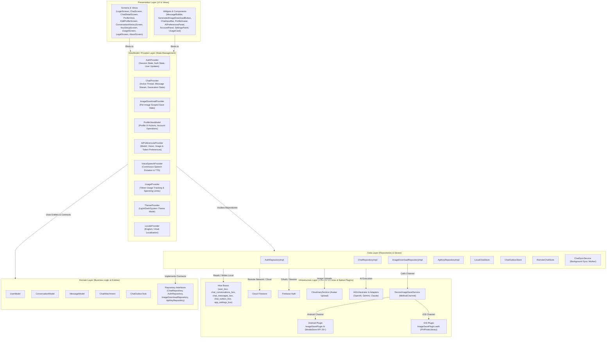

# Architecture

## Overview
- **AI Voice Genie** is a multi-model AI assistant mobile application built with Flutter using Feature-First MVVM architecture with Provider.
- Isolation of concerns: Repositories encapsulate network, database, and platform dependencies away from UI logic.
- AI requests support text generation, image generation, multi-image vision analysis, and multi-PDF document parsing via a centralized `AiOrchestrator` routing to provider adapters (OpenAI, Gemini, Claude).
- Local-First Storage & Offline Sync: Hive handles instant UI reads/writes (`chat_conversations_box`, `chat_messages_box`), an outbox queue (`chat_outbox_box`) captures pending mutations, and `ChatSyncService` reconciles remote Firestore changes asynchronously.
- Platform Native Channel Integration: Native Kotlin (`ImageSavePlugin.kt`) and Swift (`ImageSavePlugin.swift`) plugins handle scoped media downloads directly to device galleries (`Pictures/AI Voice Genie` on Android, `Photos` on iOS).

---

## MVVM Architecture Tree

---

## Folder Structure
- `lib/core`:
  - `constants/`: `app_constants.dart` (limits, assets), `firebase_collections.dart` (Firestore paths/field keys).
  - `enums/`: `app_enums.dart` (centralized enums for AI models, capabilities, roles, sync states, image download states, device save results).
  - `services/`: `storage_service.dart` (Hive initialization), `device_image_save_service.dart` (MethodChannel), `analytics_service.dart` (Firebase Analytics), `cloudinary_service.dart` (Image upload), `secure_storage_service.dart` (Encrypted keys), `ai_preferences_service.dart` (AI settings persistence).
  - `localization/`: `app_localizations.dart` (EN/HI translations map), `locale_provider.dart` (Locale state).
  - `theme/`: `app_theme.dart`, `app_colors.dart`, `theme_provider.dart`.
  - `routing/`: `app_routes.dart` (Route names and page builders).
  - `error/`: `effect_bus.dart` (Global async error propagation).
- `lib/ai_layer`:
  - `orchestrator/`: `ai_orchestrator.dart` (Central AI entry point).
  - `adapters/`: Provider-specific HTTP adapters (`openai_adapter.dart`, `gemini_adapter.dart`, `claude_adapter.dart`).
  - `models/`: Unified request/response DTOs and capability matrix.
- `lib/features/`:
  - `auth/`: Sign-in UI, `AuthProvider`, `AuthRepositoryImpl`, `UserModel`.
  - `key_setup/`: `KeySetupScreen`, `ApiKeyProvider`, `ApiKeyRepositoryImpl`.
  - `chat/`: `ChatScreen`, `ChatDetailScreen`, `ConversationHistoryScreen`, `ChatProvider`, `ChatRepositoryImpl`, `LocalChatStore`, `ChatOutboxStore`, `RemoteChatStore`, `ChatSyncService`.
  - `image_download/`: `ImageDownloadRepository`, `ImageDownloadRepositoryImpl`, `ImageDownloadProvider`, `GeneratedImageDownloadButton`.
  - `profile/`: `ProfileView`, `EditProfileScreen`, `ProfileViewModel`, `ProfileAvatar`, `AccountPanel`, `AiPreferencesPanel`, `SettingsPanel`, `SupportPanel`.
  - `voice_speech/`: `VoiceSpeechProvider`, continuous dictation widgets, grammar enhancement, TTS playback handler.
  - `usage/`: `UsageProvider`, `UsageRepositoryImpl`, token cost calculation, spending limit controls.
  - `legal_section/`: `LegalScreen` (Privacy Policy / Terms of Service toggle), `AboutScreen`.
  - `onboarding/`: Onboarding carousel slides.
  - `intro/`: `IntroScreen` home landing page.
  - `splash/`: Initial splash route and session router.

---

## Layer Responsibilities

### 1. Presentation Layer
- Contains only UI elements (Widgets, Screens, Dialogs, Snackbars, Sheets).
- Binds to ViewModels via `Provider.of`, `Consumer`, or `context.watch/select`.
- Completely decoupled from direct database or network calls.

### 2. ViewModel / Provider Layer
- Extends `ChangeNotifier` to hold reactive state and business logic.
- Exposes immutable state getters and action methods for the UI.
- Delegates data persistence and network operations to Repositories and Services.

### 3. Domain Layer
- Defines core business entities (`UserModel`, `ConversationModel`, `MessageModel`, `ChatAttachment`, `ChatOutboxTask`).
- Declares repository interfaces (`ChatRepository`, `AuthRepository`, `ImageDownloadRepository`, `ApiKeyRepository`).

### 4. Data Layer
- Implements domain repository interfaces (`ChatRepositoryImpl`, `ImageDownloadRepositoryImpl`, etc.).
- Manages local-first Hive storage (`LocalChatStore`), outbox tasks (`ChatOutboxStore`), remote Firestore sync (`RemoteChatStore`), and background sync workers (`ChatSyncService`).

### 5. Infrastructure Layer
- External APIs (Firebase Auth, Cloud Firestore, Firebase Analytics, Cloudinary).
- Native OS platform bridges (`DeviceImageSaveService` calling `ImageSavePlugin.kt` on Android and `ImageSavePlugin.swift` on iOS).

---

## Dart File Placement Audit

### Core Infrastructure Files

| File | Class / Type | Directory Judgment | Purpose |
|---|---|---|---|
| `lib/core/constants/app_constants.dart` | `AppConstants` | Correct in `core/constants` | App limits, asset paths, timeouts, default prompt templates. |
| `lib/core/constants/firebase_collections.dart` | `FirebaseCollections` | Correct in `core/constants` | Canonical Firestore collection names, document paths, and field keys. |
| `lib/core/enums/app_enums.dart` | `AiProviderId`, `AiCapability`, `MessageRole`, `MessageStatus`, `SyncStatus`, `ImageDownloadState`, `DeviceImageSaveResult` | Correct in `core/enums` | All application-wide enums for data models, UI states, analytics, and platform channels. |
| `lib/core/services/storage_service.dart` | `StorageService` | Correct in `core/services` | Global Hive initialization, box management, and data wipes. |
| `lib/core/services/device_image_save_service.dart` | `DeviceImageSaveService` | Correct in `core/services` | MethodChannel interface for saving images to native device galleries. |
| `lib/core/services/analytics_service.dart` | `AnalyticsService` | Correct in `core/services` | Centralized Firebase Analytics logging service. |
| `lib/core/services/cloudinary_service.dart` | `CloudinaryService` | Correct in `core/services` | Cloudinary API wrapper for uploading user profile pictures. |
| `lib/core/services/ai_preferences_service.dart` | `AiPreferencesService` | Correct in `core/services` | Local Hive persistence for AI preferences (model, token limits, vision quality, image size). |
| `lib/core/localization/app_localizations.dart` | `AppLocalizations` | Correct in `core/localization` | English and Hindi localization lookup table with parameter replacement. |

### Feature Files Overview

| Feature | Primary Screens / Widgets | ViewModels / Providers | Repositories / Data Stores |
|---|---|---|---|
| **Auth** | `LoginScreen` | `AuthProvider` | `AuthRepositoryImpl` |
| **Key Setup** | `KeySetupScreen` | `ApiKeyProvider` | `ApiKeyRepositoryImpl` |
| **Chat** | `ChatScreen`, `ChatDetailScreen`, `ConversationHistoryScreen`, `MessageBubble` | `ChatProvider` | `ChatRepositoryImpl`, `LocalChatStore`, `ChatOutboxStore`, `RemoteChatStore`, `ChatSyncService` |
| **Image Download** | `GeneratedImageDownloadButton` | `ImageDownloadProvider` | `ImageDownloadRepositoryImpl`, `DeviceImageSaveService` |
| **Profile** | `ProfileView`, `EditProfileScreen`, `ProfileAvatar`, `AccountPanel`, `AiPreferencesPanel` | `ProfileViewModel`, `AuthProvider`, `AiPreferencesProvider` | `AuthRepositoryImpl`, `AiPreferencesService` |
| **Voice Speech** | `VoiceSpeechWidget`, `VoiceSettingsDialog` | `VoiceSpeechProvider` | `SpeechToText`, `FlutterTts` |
| **Usage** | `UsageScreen`, `UsageCard` | `UsageProvider` | `UsageRepositoryImpl` |
| **Legal** | `LegalScreen`, `AboutScreen` | N/A | Static localized assets & metadata |
